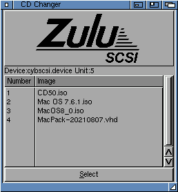
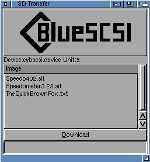

# BlueSCSI tools for the Commodore Amiga.

2 utilities for managing a [BlueSCSI V2](https://github.com/BlueSCSI/BlueSCSI-v2/) or [ZuluSCSI](https://zuluscsi.com/) in a Commodore Amiga. 

You can select the device/unit from the properties of the icon.
Optionally you can specify these on the command line.

## CD Changer
The CD Changer allows you to swap between CD ISO images on your SD card on the fly.

 

## SD Transfer
The SD Transfer tool allows you to transfer files from the SD card to the Amiga.

**History**
* 1.1 (13.05.2024) SCSI Command Descriptor length should be 10 bytes, not 6 as per the Toolbox Developer Docs. Corrected. This may have been causing the SCSI stack to crash when selecting a non-BlueSCSI device.
* 1.2 (18.05.2024)
Thanks to Stefan Reinauer for adding support for the ZuluSCSI! (https://zuluscsi.com/)
* 1.2c (18.06.2024) Removed some OS3.2 utility.library functions so older OS versions are suported. Strncpy => strncpy, Strncat => strncat.

BlueSCSI is copyright Eric Helgeson. The BlueSCSI name and logo used with permission.
