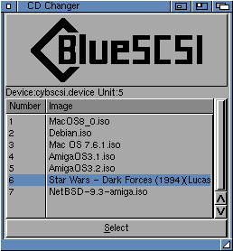

This is my BlueSCSI toolbox for the Commodore Amiga.

Currently there are 2 tools.

**CD Changer** 
This allows you to swap CD ISO images on the fly

**SDTransfer**
[Image]
This allows you to transfer files from the SD card to the Amiga.
